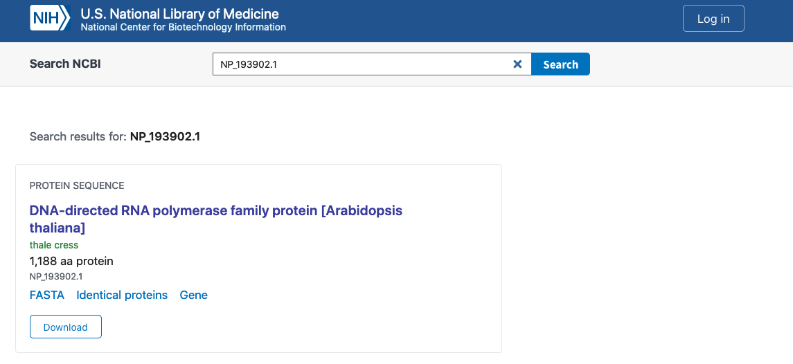
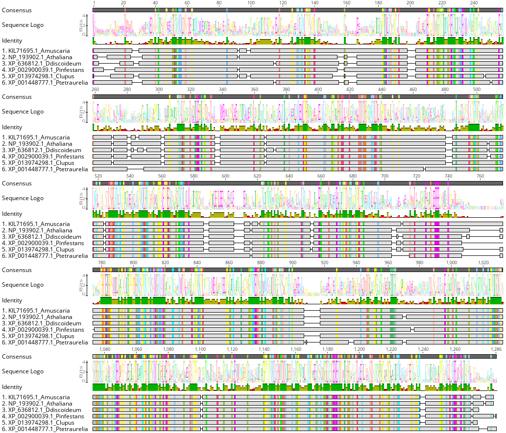

***

# Objectives

Assessments of homology using genomic data allow for the identification
of genes under selection, expansion or reduction of genic families,
analysis of presence or absence of important genes, and identification
of core genes across different taxonomic levels. These assays based on
orthologous gene searches come in different flavors, and many tools have
been created to identify homologous genes across different genomes
(e.g. OrthoMCL, InParanoid, FastOrtho, etc).

In this tutorial we will focus on OrthoFinder (Emms et al. 2015;
<https://genomebiology.biomedcentral.com/articles/10.1186/s13059-015-0721-2>),
a fast and simple software focused on phylogenetic orthology inference.
We will focus on the basics of this program, how to run it in the
cluster, and how to interpret results to identify core homologous genes,
genic duplication and how OrthoFinder reconstructs species trees based
on orthologous gene data.

***

# Data sets

OrthoFinder uses **protein sequences** in FASTA format and it performs
optimally on protein sequences predicted from whole genome sequences.
For this tutorial we want to explore orthology across the Eukaryotic
tree of life. We will use **six different species across the tree of
life**:

  - [*Canis lupus*
    (Dog)](ftp://ftp.ncbi.nlm.nih.gov/genomes/all/GCF/000/002/285/GCF_000002285.3_CanFam3.1/GCF_000002285.3_CanFam3.1_protein.faa.gz)
  - [*Amanita muscaria* (Fly
    agaric)](ftp://ftp.ncbi.nlm.nih.gov/genomes/all/GCA/000/827/485/GCA_000827485.1_Amanita_muscaria_Koide_BX008_v1.0/GCA_000827485.1_Amanita_muscaria_Koide_BX008_v1.0_protein.faa.gz)
  - [*Phytophthora infestans* (Late blight of potato and
    tomato)](ftp://ftp.ncbi.nlm.nih.gov/genomes/all/GCF/000/142/945/GCF_000142945.1_ASM14294v1/GCF_000142945.1_ASM14294v1_protein.faa.gz)
  - [*Arabidopsis thaliana* (thale
    cress)](ftp://ftp.ncbi.nlm.nih.gov/genomes/all/GCF/000/001/735/GCF_000001735.4_TAIR10.1/GCF_000001735.4_TAIR10.1_protein.faa.gz)
  - [*Dyctiostelium discoideum* (Cellular slime
    mold)](ftp://ftp.ncbi.nlm.nih.gov/genomes/all/GCF/000/004/695/GCF_000004695.1_dicty_2.7/GCF_000004695.1_dicty_2.7_protein.faa.gz)
  - [*Paramecium
    tetraurelia*](ftp://ftp.ncbi.nlm.nih.gov/genomes/all/GCF/000/165/425/GCF_000165425.1_ASM16542v1/GCF_000165425.1_ASM16542v1_protein.faa.gz)

***

# Procedure

## Obtaining data

1.  Download all of the samples to a folder in the cluster. The folder
    can be any folder that you have access to. In my case, I’ll download
    everything in my `home/` folder

<!-- end list -->

    cd ~
    mkdir orthofinder_test
    cd orthofinder_test

2.  To download these files into the structure you can either download
    them all separately or one by one. Here are the commands I use:

<!-- end list -->

    SGE_Batch -c 'curl ftp://ftp.ncbi.nlm.nih.gov/genomes/all/GCF/000/002/285/GCF_000002285.3_CanFam3.1/GCF_000002285.3_CanFam3.1_protein.faa.gz > Canis_lupus.fasta.gz' -r curl_1
    SGE_Batch -c 'curl ftp://ftp.ncbi.nlm.nih.gov/genomes/all/GCA/000/827/485/GCA_000827485.1_Amanita_muscaria_Koide_BX008_v1.0/GCA_000827485.1_Amanita_muscaria_Koide_BX008_v1.0_protein.faa.gz > Amanita_muscaria.fasta.gz' -r curl_2
    SGE_Batch -c 'curl ftp://ftp.ncbi.nlm.nih.gov/genomes/all/GCF/000/142/945/GCF_000142945.1_ASM14294v1/GCF_000142945.1_ASM14294v1_protein.faa.gz  > Phytophthora_infestans.fasta.gz' -r curl_3
    SGE_Batch -c 'curl ftp://ftp.ncbi.nlm.nih.gov/genomes/all/GCF/000/001/735/GCF_000001735.4_TAIR10.1/GCF_000001735.4_TAIR10.1_protein.faa.gz > Arabidopsis_thaliana.fasta.gz' -r curl_4
    SGE_Batch -c 'curl ftp://ftp.ncbi.nlm.nih.gov/genomes/all/GCF/000/004/695/GCF_000004695.1_dicty_2.7/GCF_000004695.1_dicty_2.7_protein.faa.gz > Dyctiostelium_discoideum.fasta.gz' -r curl_5
    SGE_Batch -c 'curl ftp://ftp.ncbi.nlm.nih.gov/genomes/all/GCF/000/165/425/GCF_000165425.1_ASM16542v1/GCF_000165425.1_ASM16542v1_protein.faa.gz > Paramecium_tetraurelia.fasta.gz' -r curl_6

3.  Decompress the fasta files

<!-- end list -->

    SGE_Batch -c 'bash; for i in *.gz; do gunzip $i; done' -r gunzip

4.  Remove all the unnecessary files

<!-- end list -->

    rm -rf curl_*/
    rm -rf gunzip/

## Summary of data

To estimate the number of proteins per downloaded genome we can count
the number of sequences in each of the FASTA files we downloaded. To do
so you can count the number of `>` characters per file. This is how I
would do it:

    for i in *.fasta; do a=$(grep -c ">" $i); printf $i"\t"$a"\n"; done

The results should look like this:

| FASTA file                      | Number of proteins |
| ------------------------------- | ------------------ |
| Amanita\_muscaria.fasta         | 18,093             |
| Arabidopsis\_thaliana.fasta     | 48,265             |
| Canis\_lupus.fasta              | 58,774             |
| Dyctiostelium\_discoideum.fasta | 13,315             |
| Paramecium\_tetraurelia.fasta   | 39,580             |
| Phytophthora\_infestans.fasta   | 17,797             |

# Downloading Orthofinder

  - Download the latest OrthoFinder.tar.gz release from github:

<!-- end list -->

    cd ~
    wget https://github.com/davidemms/OrthoFinder/releases/latest/download/OrthoFinder.tar.gz

  - Extract the files:

<!-- end list -->

    tar xzf OrthoFinder.tar.gz

  - Test OrthoFinder:

<!-- end list -->

    cd OrthoFinder/
    ./orthofinder -h

If OrthoFinder works correctly, OrthoFinder should print its ‘help’
text.

# Running OrthoFinder

For this example, we will run OrthoFinder using the default settings.
One of the greatest advantages of OrthoFinder is that the only input it
requires is the folder where the FASTA sequences are. In our case, the
FASTA aminoacid files are contained in the `~/orthofinder_test` folder.
*Make sure you have the absolute path of your folder. In my example, the
path is* `/raid1/home/bpp/tabimaj/orthofinder_test`

So, to run OrthoFinder while in the `~/OrthoFinder/` folder, you can run
the analysis using the following command by requesting 6
processors/slots from the CGRB cluster:

    SGE_Batch -c './orthofinder -f /raid1/home/bpp/tabimaj/orthofinder_test -t 8' -P 8 -r BUG_orthofinder 

# OrthoFinder results

The run of OrthoFinder took 2h 20mins using eight threads at the CGRB infrastructure.
The host which was OrthoFinder ran at was `symbiosis`.

The results of your personal OrthoFinder run should be found in the `~/orthofinder_test/Results_Feb12/` folder.
For an example run, I have a folder that will CGRB users read the files from an identical OrthoFinder folder at `/raid1/home/bpp/tabimaj/orthofinder_test/OrthoFinder/Results_Feb06_1`

While I recommend you to go to the [OrthoFinder webpage](https://github.com/davidemms/OrthoFinder) to understand what files and results come as output from the program, we will focus in four main results today:

- The **Statistics Overall** file
- The **Statistics Per Species** file
- The count of genes per **Orthogroup** predicted by OrthoFinder 
- The **Single copy orthologs** and the **Species Tree**


## Statistics Overall

> Location: `/raid1/home/bpp/tabimaj/orthofinder_test/OrthoFinder/Results_Feb06_1/Comparative_Genomics_Statistics/Statistics_Overall.tsv`

The  **Statistics Overall** file is a tab-separated text file that contains general statistics about orthogroup sizes and proportion of genes assigned to orthogroups. 

As mentioned by the [OrthoFinder webpage](https://github.com/davidemms/OrthoFinder):

>Most of the terms in the files 'Statistics_Overall.csv' and 'Statistics_PerSpecies.csv' are self-explanatory, the remainder are defined below.

>Species-specific orthogroup: An orthogroups that consist entirely of genes from one species.

>G50: The number of genes in the orthogroup such that 50% of genes are in orthogroups of that size or larger.

>O50: The smallest number of orthogroups such that 50% of genes are in orthogroups of that size or larger.

>Single-copy orthogroup: An orthogroup with exactly one gene (and no more) from each species. These orthogroups are ideal for inferring a species tree and many other analyses.

>Unassigned gene: A gene that has not been put into an orthogroup with any other genes.

Lets take a look at the file. Even if this is a "tab-separated" file, we need to split it on sections:

####  Section 1: Overall statistics (Lines 1 to 24)

```{r, results='asis'}
library(magrittr)
library(knitr)
library(kableExtra)

knitr::kable(read.table("Results/Statistics_Overall.tsv",fill = T, nrows = 24, sep = "\t")) %>%
 kable_styling(bootstrap_options = c("striped", "hover", "condensed", "responsive"))
```


#####  Questions (Section 1):

1. What is the number of *orthogroups that consist entirely of genes from one species*? Is it the majority of data? What percentage of the orthogroups is is?

2. What is the number of *single-copy orthogroups* found in the analysis? What does this mean biologically? 
 
####  Section 2: Genes per Orthogroup (Lines 26-45)

```{r,  results='asis'}
genes_per_OG <- read.delim("Results/Statistics_Overall.tsv",fill = T, skip = 25, nrows = 20, sep = "\t")
kable(genes_per_OG) %>% kable_styling(bootstrap_options = c("striped", "hover", "condensed", "responsive"))
```

I think its easier to see these results on a plot than in the table 

```{r, fig.height=12, fig.width=12}
library(reshape2)
library(tidyverse)
genes_per_OG.m <- melt(genes_per_OG, id.vars = "Average.number.of.genes.per.species.in.orthogroup", factorsAsStrings = T)
genes_per_OG.m$Average.number.of.genes.per.species.in.orthogroup <- factor(genes_per_OG.m$Average.number.of.genes.per.species.in.orthogroup,levels = as.character(genes_per_OG$Average.number.of.genes.per.species.in.orthogroup))

ggplot(genes_per_OG.m, aes(x=Average.number.of.genes.per.species.in.orthogroup , y=value, fill=variable)) + geom_bar(stat="identity") + facet_grid(variable~., scales = "free_y") + scale_fill_viridis_d() + theme_bw() + theme(legend.position = "none") 
```

#####  Questions (Section 2):

1. What is the overall pattern of the results we find? 

####  Section 3: Species per Orthogroup (Lines 47-54)

```{r}
species_per_OG <- read.delim("Results/Statistics_Overall.tsv",fill = T, skip = 46, nrows = 7, sep = "\t", header = T)
kable(species_per_OG) %>% kable_styling(bootstrap_options = c("striped", "hover", "condensed", "responsive"))

ggplot(species_per_OG, aes(x=as.factor(Number.of.species.in.orthogroup), y=Number.of.orthogroups, fill=as.factor(Number.of.species.in.orthogroup))) + geom_bar(stat="identity") + scale_fill_viridis_d() + theme_bw() + theme(legend.position = "none")  + xlab("Number of species on orthogroup") + ylab("Number of orthogroups")
```

#####  Questions (Section 3):

1. The highest number of orthogroups contain only one species. What are the biological implications of this result?

2. If OrthoFinder was used in a subset of highly-similar species, would this result be similar or would it change? How so?

***

## Statistics per Species

> Location: `/raid1/home/bpp/tabimaj/orthofinder_test/OrthoFinder/Results_Feb06_1/Comparative_Genomics_Statistics/Statistics_PerSpecies.tsv`

The  **Statistics per Species** file is a tab-separated text file that contains general statistics about the number of genes that are within each category of orthogroups for each species. As with the **Statistics Overall** table, we have to divide it into different sections:

####  Section 1: Overall statistics (Lines 1 to 24)

```{r, results='asis'}
overall_stats <- read.table("Results/Statistics_PerSpecies.tsv",fill = T, nrows = 10, sep = "\t", header = T)
species_names <- colnames(overall_stats)[-1]

knitr::kable(overall_stats) %>%
 kable_styling(bootstrap_options = c("striped", "hover", "condensed", "responsive"))
```

As these results are very numerous, lets graph them. We will do a subset of the non-percentage data first:

```{r, fig.height=12, fig.width=12}
overall_stats.number <- overall_stats[grep(x = overall_stats$X, pattern = "Number"),]
overall_stats.number <- melt(overall_stats.number)
overall_stats.number$X <- gsub(overall_stats.number$X, pattern = "Number of ", replacement = "") %>% tools::toTitleCase()

ggplot(overall_stats.number, aes(x=variable , y=value, fill=X)) + geom_bar(stat="identity") + facet_grid(X~., scales = "free_y") + scale_fill_viridis_d() + theme_bw() + theme(legend.position = "none") + ylab("Number")
```


#####  Questions (Section 1 - Numeric results):

1. What is the species with the most and the least number of genes used in the analysis?

2. What does the *Species specific orthologs* category mean? Is this representing paralogy?

3. Does this table/plot accurately represent the contribution of each species to the orthology assay?

*** 

While the numeric results provide us with an overall assay of the general results of the orthologous assay, the data formatted in percentages may prove a more standardized vision of the results:

```{r, fig.height=12, fig.width=12}
overall_stats.percentage <- overall_stats[grep(x = overall_stats$X, pattern = "Number", invert = T),]
overall_stats.percentage <- melt(overall_stats.percentage)
overall_stats.percentage$X <- gsub(overall_stats.percentage$X, pattern = "Percentage of ", replacement = "") %>% tools::toTitleCase()

ggplot(overall_stats.percentage, aes(x=variable , y=value, fill=X)) + geom_bar(stat="identity") + facet_grid(X~., scales = "free_y") + scale_fill_viridis_d() + theme_bw() + theme(legend.position = "none") + ylab("Percentage (%)")
```

#####  Questions (Section 1 - Percentage results):

1. What is the species with the most shared genes across the entire data set?

#### Section 2. Per species- per ortholog statistics (Lines 14 to 56)

The second section of the **Statistics per Species** file includes all the statistics of the number and percentage of orthologs that contain data for each species. For today we will focus only on the percentages (Lines 35 - 56):

```{r, results='asis'}
perecentage_stats <- read.delim("Results/Statistics_PerSpecies.tsv",fill = T, skip = 35, nrows = 20, sep = "\t", header = T)
colnames(perecentage_stats)[-1] <- species_names

knitr::kable(perecentage_stats) %>%
 kable_styling(bootstrap_options = c("striped", "hover", "condensed", "responsive"))

perecentage_stats$Number.of.genes.per.species.in.orthogroup <- factor(perecentage_stats$Number.of.genes.per.species.in.orthogroup, levels = perecentage_stats$Number.of.genes.per.species.in.orthogroup)

perecentage_stats <- melt(perecentage_stats)

ggplot(perecentage_stats, aes(x=Number.of.genes.per.species.in.orthogroup , y=value, fill=variable)) + geom_bar(stat="identity", position = "dodge") + scale_fill_viridis_d() + theme_bw() + theme(legend.position = "bottom") + ylab("Percentage (%)")
```

#####  Questions (Section 2 - Percentage results):

1. Why are these results expected?

#### Section 2. Per species- per ortholog statistics (Lines 14 to 56)

The second section of the **Statistics per Species** file includes all the statistics of the number and percentage of orthologs that contain data for each species. For today we will focus only on the percentages (Lines 35 - 56):

```{r, results='asis'}
perecentage_stats <- read.delim("Results/Statistics_PerSpecies.tsv",fill = T, skip = 35, nrows = 20, sep = "\t", header = T)
colnames(perecentage_stats)[-1] <- species_names

knitr::kable(perecentage_stats) %>%
 kable_styling(bootstrap_options = c("striped", "hover", "condensed", "responsive"))

perecentage_stats$Number.of.genes.per.species.in.orthogroup <- factor(perecentage_stats$Number.of.genes.per.species.in.orthogroup, levels = perecentage_stats$Number.of.genes.per.species.in.orthogroup)

perecentage_stats <- melt(perecentage_stats)

ggplot(perecentage_stats, aes(x=Number.of.genes.per.species.in.orthogroup , y=value, fill=variable)) + geom_bar(stat="identity", position = "dodge") + scale_fill_viridis_d() + theme_bw() + theme(legend.position = "bottom") + ylab("Percentage (%)")
```

#####  Questions (Section 2 - Percentage results):

1. Why are these results expected?

*** 

## The count of genes per **Orthogroup** predicted by OrthoFinder 

> Location: `/raid1/home/bpp/tabimaj/orthofinder_test/OrthoFinder/Results_Feb06_1/Orthogroups/Orthogroups.GeneCount.tsv`

The **Statistics per Species** and **Statistics Overall** files provided us with a general view of the contribution of each genome and each orthogroup into our orthology analysis.
For a more detailed look into our results, we should look at the **Orthogroups GeneCount** file
This file includes the number of genes per species that are grouped inside each predicted orthogroup (OG).

Lets take a look at the first 5 rows of the file:

```{r}
og.gene_count <- read.table("Results/Orthogroups.GeneCount.tsv", header = T)

head(og.gene_count) %>% knitr::kable() %>%
 kable_styling(bootstrap_options = c("striped", "hover", "condensed", "responsive"))
```

The results of the **Orthogroups GeneCount** file are sorted by number of total genes per orthogroup.
These results show that the contributions of each species into each orthogroup are quite different. For OG0000000 we see all genes (238 genes) are contributed by *Amanita muscaria*.
This is a **Single species orthogroup**. 

Conversely, OG0000003, OG0000004 and OG0000005 are comprised by many genes of different species. So these are **Shared species orthogroups**.

We can observe the general pattern of the orthogroups by plotting a heat map for the first 200 orthogroups without the `Total` column

```{r, fig.height=24, fig.width=12}
library(vcfR)
OG.mtrix <- as.matrix(og.gene_count[c(1:200),-c(1,8)])
rownames(OG.mtrix) <- og.gene_count[c(1:200),1]
OG.mtrix[OG.mtrix == 0] <- NA
heatmap.bp(OG.mtrix)
```

Several things can be concluded from that figure. 
First, that the distribution of species that contribute in each OG is patchy. 
Second, that for the first 200 OG, the species that contribute the most genes are *A. thaliana* and *C. lupus*.
Third, that there are some OG that have genes in every species.
When we review the results of the **Statistics Overall** table, we remember that 1319 OG have all species present. 
We should be able to see the contributions of each species per OG by removing all OG with values of 0 and counting the remaining OG:

```{r}
non_zero_OG <- og.gene_count[apply(og.gene_count[,-1], 1, function (x) sum(x == 0) == 0),]
nrow(non_zero_OG)
```

Woohoo! Lets see the first 10 rows of the OG with all species:

```{r}
head(non_zero_OG, n=10) %>% knitr::kable() %>%
 kable_styling(bootstrap_options = c("striped", "hover", "condensed", "responsive"))
```

What about the last 10 rows? 

```{r}
tail(non_zero_OG, n=10) %>% knitr::kable() %>%
 kable_styling(bootstrap_options = c("striped", "hover", "condensed", "responsive"))
```

####  Questions (Section 3):

1. What is the biological importance of these OG that have genes in every species? 

2. What are the last 10 rows showing us? Why are these OG important?

***

## The **Single copy orthologs** and the **Species Tree**

Finally, we will focus in two very important results of OrthoFinder: The **Single copy orthologs** and the **Species Tree**. 


###  The **Single copy orthologs** 

The **Single copy orthologs** are homologous and orthologous genes that exist in every single species and only have one copy.
These genes are of fundamental importance for molecular evolution, as are genes that can be used to study the impacts of selection or drift across our data set. 
In our case, the tree of life.
We can identify those genes by summarizing the **Orthogroups GeneCount** file, or by summarizing the number of `.fasta` files in the **Single_Copy_Orthologue_Sequences** folder in our OrthoGroups folder.

We have a total of 32 single copy ortholog groups across our data set.
If we want to know the function, we can use a very well annotated genome and search for the function.

For example, `OG0008354.fa` has the *A. thaliana* gene `NP_193902.1`. We can go to NBCI and check the annotation of this gene:



As we can see, the `NP_193902.1` gene has the annotation associated with `DNA-directed RNA polymerase family protein`, so we can infer that this function is conserved across the tree of life.


In addition, we can see if this protein sequence has evolved differently across the tree of life.
To do so, we can do a multiple sequence alignment of the `OG0008354.fa` gene using [MAFFT](https://mafft.cbrc.jp/alignment/server/index.html)



The MSA statistics show that this protein family has 366 (28.5%) identical sites, with a pairwise Identity: of 56.0%. So its quite the conserved gene across the eukaryotic tree of life.

####  Questions (Section 4 - **Single copy orthologs**):

1. What are the other functions of the other single copy OG?

2. Are the other single copy OG more or less conserved phylogenetically than OG0008354?

***

###  The **Species tree ** 

The **Species Tree** is the phylogenetic reconstruction of the species used in this orthology analysis. How is it calculated? According to [Emms and Kelly, 2019](https://genomebiology.biomedcentral.com/articles/10.1186/s13059-019-1832-y):

>OrthoFinder infers orthologs from the orthogroup trees (a gene tree for the orthogroup) using the steps shown in Fig. 2. Input proteomes are provided by the user using one FASTA file per species. Each file contains the amino acid sequences for the proteins in that species. Orthogroups are inferred using the original OrthoFinder algorithm [10]; an unrooted gene tree is inferred for each orthogroup using DendroBLAST [24]; the unrooted species tree is inferred from this set of unrooted orthogroup trees using the STAG algorithm [33]; this STAG species tree is then rooted using the STRIDE algorithm by identifying high-confidence gene duplication events in the complete set of unrooted orthogroup trees [22]; the rooted species tree is used to root the orthogroup trees; orthologs and gene duplication events are inferred from the rooted orthogroup trees by a novel hybrid algorithm that combines the “species-overlap” method [31] and the duplication-loss-coalescent model [32] (described below); and comparative statistics are calculated. 

So, how does the species tree look?
We can find it at `~/orthofinder_test/OrthoFinder/Results_Feb06_1/Species_Tree/SpeciesTree_rooted.txt`. We can open it on R:

```{r, fig.height=12, fig.width=12}
library(ggtree)

species.tree <- read.tree("Results/SpeciesTree_rooted.txt.tre")

ggtree(species.tree, layout = "circular") + geom_tiplab2(size=3) + xlim(0, 1)
```

####  Questions (Section 4 - **Species tree**):

1. How does the tree look? Does it make sense biologically?
